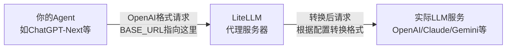

# LiteLLM

统一调用 100+ 大语言模型 API 的 Python SDK 和代理服务器。

---

## 概述

LiteLLM 由 BerriAI 团队在 2023 年初创建，后进入 Y Combinator 2023 年冬季批次（W23）加速器。目前已有超过 37,000 GitHub Stars，被 Stripe、Netflix、Google 等公司使用。

功能：
- OpenAI 格式调用各种 LLM（Bedrock、Azure、Anthropic、VertexAI、Cohere、Groq 等）
- 成本追踪、负载均衡、访问控制

---

## 工作流程

1. 应用/Agent 使用 OpenAI SDK，将 base_url 指向 LiteLLM 代理（默认 http://localhost:4000）
2. LiteLLM 代理接收标准 OpenAI 格式请求（/chat/completions 等）
3. LiteLLM 转换请求格式为目标 LLM 提供商的特定格式
4. 转发到实际 LLM（如 OpenAI、Anthropic、Azure、Bedrock 等）
5. 返回结果统一为 OpenAI 格式响应
