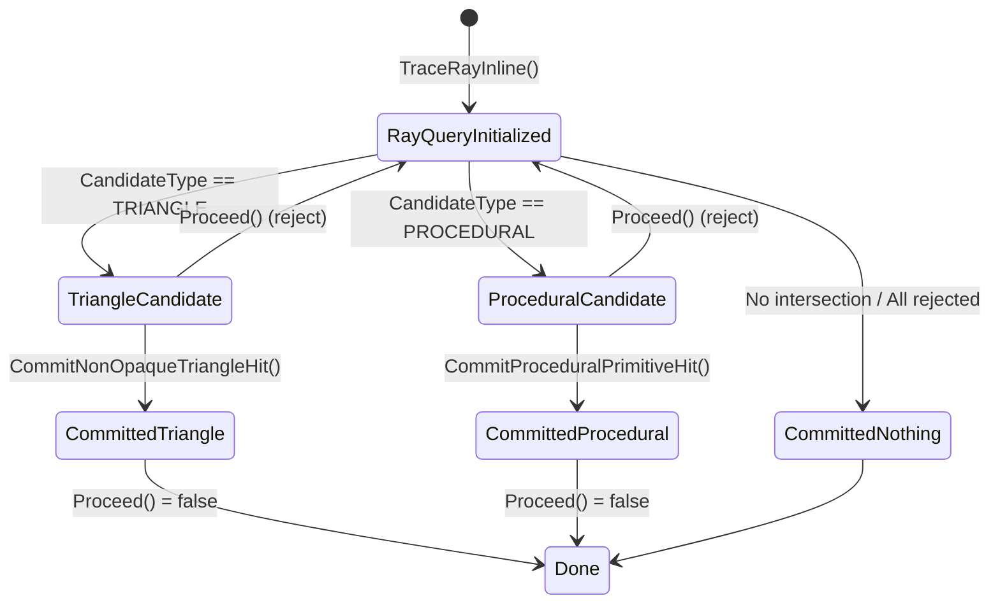

# Inline Ray Tracing

Ray Query 是 Shader 内直接发起的光追查询（无需调用 TraceRay()）。

## Ray Query 状态机



## 基本流程

```hlsl
RayQuery<RAY_FLAG_NONE> q;
// 1. 启动查询（设置光线和加速结构）
q.TraceRayInline(
    TLAS,                           // 加速结构
    RAY_FLAG_NONE,                  // 光线标志
    0xFF,                           // 实例掩码
    RayDesc(origin, tMin, direction, tMax)
);
// 2. 遍历所有候选相交
while (q.Proceed()) {
    switch (q.CandidateType()) {
        case CANDIDATE_NON_OPAQUE_TRIANGLE:
            // 检查 alpha 等，决定是否提交
            if (acceptTriangle(q)) {
                q.CommitNonOpaqueTriangleHit();
            }
            break;
            
        case CANDIDATE_PROCEDURAL_PRIMITIVE:
            // 计算实际交点 t
            float t = intersectProcedural(q);
            if (t > 0) {
                q.CommitProceduralPrimitiveHit(t);
            }
            break;
    }
}
// 3. 查询结束，获取最终结果
switch (q.CommittedStatus()) {
    case COMMITTED_TRIANGLE_HIT:
        // 处理三角形命中
        float2 uv = q.CommittedTriangleBarycentrics();
        break;
        
    case COMMITTED_PROCEDURAL_PRIMITIVE_HIT:
        // 处理程序式命中
        float t = q.CommittedRayT();
        break;
        
    case COMMITTED_NOTHING:
        // 未命中，处理 miss
        break;
}
```

## Candidate

Candidate（候选相交）= 光线遍历过程中发现的潜在命中点，但还未被 Shader 最终确认。

| | Triangle Candidate | Procedural Candidate |
|:---|:---|:---|
| **几何定义** | 顶点缓冲区中的三角形 | 仅 AABB + 自定义逻辑 |
| **交点计算** | 硬件自动完成 | Shader 手动计算 |
| **属性获取** | 自动插值 UV、法线、切线 | 无，需自行计算 |
| **提交方式** | `CommitNonOpaqueTriangleHit()` | `CommitProceduralPrimitiveHit(tHit)` |
| **性能** | 更快（硬件加速） | 更灵活但 Shader 开销大 |

### Triangle Candidate

光线与三角形网格的潜在相交。

特点：
- 硬件自动计算交点、重心坐标、法线
- Shader 可以检查并决定接受或拒绝

```hlsl
while (q.Proceed()) {
    if (q.CandidateType() == CANDIDATE_NON_OPAQUE_TRIANGLE) {
        // 自动获得插值数据
        float2 uv = q.CandidateTriangleBarycentrics();
        float t = q.CandidateTriangleRayT();
        
        // 根据 alpha 纹理决定是否提交
        if (sampleAlpha(uv) > 0.5) {
            q.CommitNonOpaqueTriangleHit(); // 确认命中
        }
    }
}
```

使用场景：带透明贴图的植被、栅栏、树叶等。

### Procedural Candidate

光线与 AABB 包围盒的相交，盒内几何由 Shader 程序化生成。

特点：
- 硬件只检测与 AABB 的相交
- 具体交点必须由 Shader 自己计算（如球体、隐式曲面）
- 没有预定义顶点属性

```hlsl
while (q.Proceed()) {
    if (q.CandidateType() == CANDIDATE_PROCEDURAL_PRIMITIVE) {
        // 只获得 AABB 信息
        uint primitiveIdx = q.CandidatePrimitiveIndex();
        
        // Shader 手动计算实际交点
        float tHit = computeSphereIntersection(primitiveIdx, ray);
        
        if (tHit > 0) {
            q.CommitProceduralPrimitiveHit(tHit); // 必须传入 t 值！
        }
    }
}
```

使用场景：粒子系统、体积云、SDF 物体、头发丝、复杂隐式曲面。

## Committed

在 Inline Ray Tracing（如 DXR 1.1+ 或 Vulkan Ray Query）中，Committed 是 Ray Query 对象的核心状态，表示光线是否已经与场景中的几何体确定了最终相交点。

**为什么要设计 Committed**：核心目的是，给 Shader 控制权，支持灵活的 any-hit 处理。

传统的 TraceRay() 把相交判定完全交给硬件/驱动，而 Ray Query 把控制权还给 Shader：
1. 自定义透明度处理 - Shader 可以决定哪些三角形是"真的"挡住了光线
2. 逐像素的相交筛选 - 比如根据纹理 alpha、材质属性动态决定
3. **early-out 优化** - 找到想要的相交后立即停止，避免无效遍历

### Committed 状态的含义

Committed 表示查询已经确定了一个有效的相交点，后续不再接受新的候选相交。触发条件：

1. `RayQuery::CommitNonOpaqueTriangleHit()` - 提交非透明三角形相交
2. `RayQuery::CommitProceduralPrimitiveHit()` - 提交程序式图元相交
3. 自动提交 - 当 RayFlags 包含 `RAY_FLAG_ACCEPT_FIRST_HIT_AND_END_SEARCH` 时，首个有效相交自动提交

### Committed 状态枚举

在 DXR/HLSL 中：

```c++
enum COMMITTED_STATUS {
    COMMITTED_NOTHING,              // 未提交任何相交
    COMMITTED_TRIANGLE_HIT,         // 提交了三角形相交
    COMMITTED_PROCEDURAL_PRIMITIVE_HIT  // 提交了程序式图元相交
};
```

Vulkan GLSL 中对应：

```glsl
rayQueryCommittedIntersectionNoneEXT
rayQueryCommittedIntersectionTriangleEXT  
rayQueryCommittedIntersectionGeneratedEXT
```

| 状态 | 含义 |
|:---|:---|
| COMMITTED_NOTHING | 光线未命中任何几何体，或 Shader 拒绝了所有候选 |
| COMMITTED_TRIANGLE_HIT | 确定了三角形相交点（包括透明/不透明） |
| COMMITTED_PROCEDURAL_PRIMITIVE_HIT | 确定了自定义图元相交（如 AABB 内的隐式曲面） |

### 细分状态的原因

1. **管线阶段差异**
   - 三角形：硬件自动插值顶点属性（UV、法线）
   - 程序式图元：Shader 需手动计算相交点和属性

2. **数据获取 API 不同**

   ```hlsl
   // 三角形命中：直接读插值属性
   float2 uv = q.CommittedTriangleBarycentrics();
   float3 normal = q.CommittedTriangleObjectNormal();
   // 程序式命中：只能读基础数据
   float t = q.CommittedRayT();
   uint primitiveIdx = q.CommittedPrimitiveIndex();
   // 法线/UV 需要你自己从 custom data 计算
   ```

3. **性能与一致性**
   - 明确区分类型避免 Shader 分支预测失败
   - 允许驱动为不同类型优化遍历策略

4. **扩展性**
   - 未来可能支持更多图元类型（如曲线、细分曲面），状态机结构易于扩展

### 关键注意点

- Committed 后 `Proceed()` 返回 false - 查询提前结束
- `CommittedRayT()` - 返回已提交相交的射线参数 t
- `CommittedGeometryIndex()` / `CommittedPrimitiveIndex()` - 获取命中图元信息
- 与 Pipeline 模式区别：Ray Query 的 Committed 是 Shader 内决定，而 TraceRay() 交由 IH 处理
